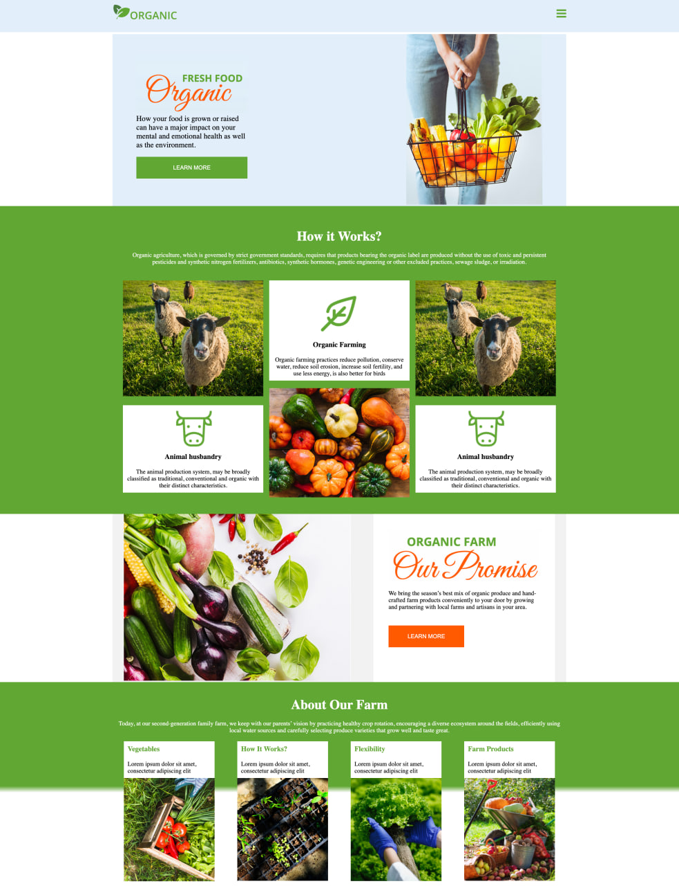

# 🌱 Organic

Welcome to **Organic** — a clean, responsive website designed to promote healthy and sustainable organic farming practices.
🔗 **Live Demo:** [narek-melkumyan.github.io/Organic](https://narek-melkumyan.github.io/Organic/)




📂 **GitHub Repo:** [github.com/Narek-Melkumyan/Organic](https://github.com/Narek-Melkumyan/Organic)

---

## 📋 Project Description

**Organic** is a responsive landing page built entirely with **HTML5** and **CSS3**, without any frameworks or libraries. It showcases:

- Organic food and farming practices
- Animal husbandry information
- Farm promises and eco-friendly methods
- A modern, mobile-first design

This project highlights clean code, semantic HTML, reusable CSS components, and full responsiveness across all devices.

---

## 🚀 Features

- ✅ Fully responsive design (mobile, tablet, desktop)
- ✅ Clean, semantic HTML structure
- ✅ CSS Flexbox & Grid layout
- ✅ Modern design with call-to-action elements
- ✅ Sections: Hero, How it Works, Our Promise, About the Farm

---

## 🖼️ Sections Overview

1. **Hero Section** – Intro to organic food & call to action
2. **How it Works** – Visuals and description of farming & animal care
3. **Our Promise** – Commitment to quality and local produce
4. **About Our Farm** – Description of services with icons and visuals

---

## 💻 Technologies Used

- HTML5
- CSS3
- Responsive Web Design (Media Queries, Flexbox, Grid)
- Visual content & layout optimization

---

## 🙋 About Me

👨‍💻 **Narek Melkumyan**  
🔗 [LinkedIn Profile](https://www.linkedin.com/in/narek-melkumyan-60164a374/)  
🐙 [GitHub Profile](https://github.com/Narek-Melkumyan)

---

## 📌 How to Use

1. Clone the repository:
```bash
git clone https://github.com/Narek-Melkumyan/Organic.git
